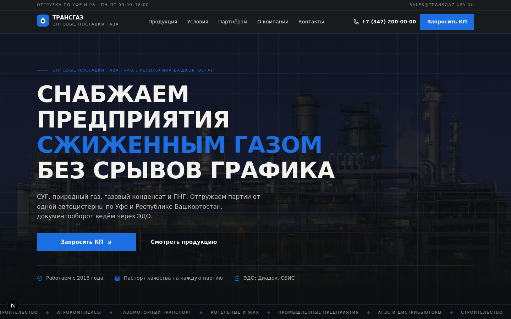
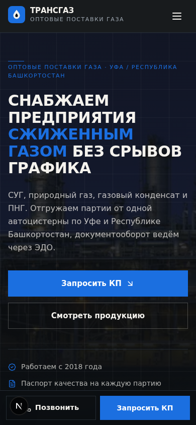

# ТРАНСГАЗ — корпоративный сайт оптовых поставок газа

B2B-сайт компании ООО «ТРАНСГАЗ» (Уфа): оптовые поставки СУГ, природного газа,
газового конденсата и ПНГ предприятиям Республики Башкортостан.

Проект собран командой веб-студии по оркестратор-модели: аналитика → UX → арт-дирекшн →
копирайтинг → разработка → юридический комплаенс → QA. Главная цель — премиальный вид
без «AI-генерации» и **заявка за 30 секунд с мобильного**.

> **Живое демо (GitHub Pages):** <https://gameai2027-gif.github.io/transgaz-site/>
> Статичная сборка без сервера: приём заявок отключён — форма честно сообщает об этом
> и показывает телефон. Полная версия с API/SQLite запускается локально (см. ниже).

| Десктоп (1440px) | Мобайл (390px) |
| --- | --- |
|  |  |

## Ключевые решения

- **Mobile-first вёрстка** — основной макет под 390px, проверено на 320px без overflow
- **Заявка за 30 секунд** — RFQ-форма из 4 полей + sticky-CTA + модальное КП на каждом экране
- **Дизайн-система** — графит `#0C0F12` + тёплая бумага `#F4F2ED` + сине-голубое пламя газа
  `#1B6FE0` («газ — голубое топливо»); Unbounded / Onest / JetBrains Mono
- **Реальные фотографии** производства, а не стоковые абстракции
- **Юридический контур (152-ФЗ)** — политика ПДн, согласие с обязательным чекбоксом,
  реквизиты в футере
- **SEO** — коммерческие посадочные тексты, Schema.org (WholesaleStore), sitemap, robots, OG
- **Анти-спам** — honeypot, тайминг-проверка, rate-limit, zod-валидация на сервере

## Стек

Next.js 16 (App Router) · TypeScript · Tailwind CSS 4 · Prisma + SQLite · lucide-react

## Быстрый старт

```bash
bun install
npx prisma generate && npx prisma db push
bun run dev        # http://localhost:3000
```

`.env` (создаётся автоматически):

```
DATABASE_URL=file:./db/custom.db
# опционально — уведомления о заявках в Telegram:
TELEGRAM_BOT_TOKEN=
TELEGRAM_CHAT_ID=
```

## Конфигурация компании

Точка правды — `src/config/company.ts`: контакты, реквизиты, цифры, продукты, FAQ.
Демо-значения помечены комментарием `EDIT:` — замените телефон, ИНН/ОГРН и статистику
на реальные перед запуском.

## API

`POST /api/lead` — приём заявки: zod-схема, honeypot `website`, тайминг заполнения,
rate-limit по IP, запись в SQLite (`Lead`), хук `notifyManager` для Telegram/email.

## Структура

```
src/
  app/            # страница, layout (мета + JSON-LD), api/lead, sitemap, robots
  components/site/  # hero, продукция, условия, RFQ, FAQ, контакты, модалки…
  config/         # company.ts (данные компании), legal.tsx (ПДн, 152-ФЗ)
  lib/            # zod-схема лида, rate-limit, notifyManager
docs/
  orchestrator-prompt.md   # промт оркестратора: роли, подроли, гейты качества
  screenshots/             # контрольные скриншоты QA
```

## Проверка качества

Мобильный 390/320px без горизонтального скролла, золотой путь (2 заявки сохранены в БД),
маска телефона, фокус-ловушки модалок, контраст акцента ≥ 4.5:1 на CTA (WCAG AA).
Скрипт проверки заявок: `bun scripts/check-leads.ts`.
